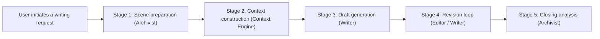

<div align="center">
  

  <p>
    <strong>Deep context-aware, agent-based novel writing system</strong><br />
    <em>Deep Context-Aware Agent-Based Novel Writing System</em>
  </p>

  <p>
    <a href="./LICENSE"></a>
    
    
    
  </p>

  <p>
    <a href="./README.md">中文</a> &middot;
    <a href="#quick-start">Quick Start</a> &middot;
    <a href="#user-guide">User Guide</a> &middot;
    <a href="#system-architecture">Architecture</a> &middot;
    <a href="#tech-stack">Tech Stack</a> &middot;
    <a href="#contributing">Contributing</a> &middot;
    <a href="#license">License</a>
  </p>
</div>

---

## What is WenShape

WenShape is a **Context Engineering** system built for long-form novel writing. Its core challenge is: when a story spans tens of thousands of words, LLMs inevitably forget early settings and introduce inconsistencies. WenShape addresses this with an **orchestrated writing workflow**, **dynamic canon tracking**, and **precise token budgeting**.

All project data is stored as plain text in YAML / Markdown / JSONL, making it naturally compatible with Git version control.

---

## Core Design

### Orchestrated writing workflow

The system is driven by an Orchestrator that runs the full writing session. The orchestrator schedules dedicated modules stage-by-stage. Each module has its own system prompt, and can be configured with different LLM providers and temperatures.

A complete writing session executes the following pipeline:



| Stage | Goal | Key outputs |
| :--- | :--- | :--- |
| 1 Scene preparation | Build a structured, searchable entry for “what this chapter is about” | Scene Brief (character/setting cards, facts, summary, timeline) |
| 2 Context construction | Organize “the most relevant information” within a limited token budget | Memory Pack (Working Memory + Evidence hits + Gap/Questions) |
| 3 Draft generation | Stream the first draft, handling uncertain details with vague narration | Draft text |
| 4 Revision loop | Apply edits with minimal changes to avoid unintended collateral impact | Patch ops (replace/insert/delete) + Diff preview |
| 5 Closing analysis | Persist this chapter into searchable assets for reuse in future chapters | Chapter summary + Canon (facts/timeline/states) |

> **Note**: Archivist / Writer / Editor are not autonomous agents that make independent decisions. They are dedicated modules scheduled by the orchestrator on demand. Each module maintains its own system prompt and LLM configuration, while the execution order and timing are decided by the orchestrator.

### Context Engine

The Context Engine selects the most relevant information within a limited token budget before each LLM call.

**Budget allocation strategy** (default: 128K tokens):

| Allocation target | Ratio | Description |
| :--- | :--- | :--- |
| System rules | 5% | Behavioral constraints and prompts |
| Character / world cards | 15% | Setting cards related to the current scene |
| Dynamic canon table | 10% | Accumulated key story facts |
| Historical summaries | 20% | Compressed summaries of completed chapters |
| Current draft | 30% | The chapter content being created |
| Output reserve | 20% | Reserved for model generation |

The **selection engine** uses two layers:
1. **Deterministic selection**: always-include items such as style cards and scene briefs to ensure consistent writing style.
2. **Retrieval-based selection**: score candidate cards (up to 50 per type) with a hybrid of BM25 and token overlap, then return the Top-K most relevant items.

### Dynamic Canon (Canon)

After each chapter is confirmed, the system runs closing analysis: it uses an LLM call to extract newly introduced canon entries (character state changes, location transitions, item acquisition, etc.) and appends them into a JSONL canon table. At the same time, it applies heuristic rules (based on action verbs, specific suffixes, and frequency thresholds) to detect potential new characters and world settings, and presents them as proposals for user confirmation.

For subsequent chapter generation, the canon table participates in the Context Engine’s scoring and ranking, helping maintain long-form narrative consistency.

### Fanfiction support

Built-in wiki crawling and structured extraction support importing character and world information in bulk from Moegirlpedia, Fandom, Wikipedia, and more. The system automatically parses infoboxes and main content, and generates editable setting cards.

---

## System Architecture

```
frontend/ (React 18 + Vite + TypeScript)
├── pages/              Page components (project list, writing session, settings)
├── components/ide/     IDE-style 3-part layout (ActivityBar + SidePanel + Editor)
├── context/            Global state management (IDEContext, reducer pattern)
├── hooks/              Custom hooks (WebSocket tracing, debounced requests)
└── api.ts              Unified API layer (Axios, 12 modules, WebSocket reconnect)

backend/ (FastAPI + Pydantic v2)
├── agents/             Dedicated modules (Archivist / Writer / Editor / Extractor)
│   ├── base.py         Base class: unified LLM calls, token tracing, message building
│   ├── writer.py       Writer: research loop + streaming generation
│   ├── editor.py       Editor: patch generation + selection editing + fallback strategies
│   ├── archivist.py    Archivist: scene brief + fact detection + card scoring
│   └── extractor.py    Extractor: Wiki → structured cards
├── orchestrator/       Orchestrator
│   ├── orchestrator.py Full session coordination
│   ├── _context_mixin  Context & memory pack preparation
│   └── _analysis_mixin Chapter analysis & canon updates
├── context_engine/     Context Engine
│   ├── select_engine   Two-layer strategy (deterministic + retrieval)
│   ├── budget_manager  Token budgeting and tracking
│   └── smart_compressor Smart compression for history dialogue
├── llm_gateway/        LLM gateway
│   ├── gateway.py      Unified interface: retry, streaming, cost tracking
│   └── providers/      9 provider adapters (OpenAI / Anthropic / DeepSeek / Qwen / Kimi / GLM / Gemini / Grok / Custom)
├── routers/            REST API (15 router modules)
├── services/           Business logic layer
├── storage/            Filesystem storage (YAML / Markdown / JSONL)
└── data/               Project data directory (Git-Native)
```

### Data storage layout

```
data/{project_id}/
├── project.yaml          Project metadata
├── cards/                Setting cards (characters, world, style)
│   ├── character_001.yaml
│   └── worldview_001.yaml
├── canon/                Dynamic canon table
│   └── facts.jsonl
├── drafts/               Chapter drafts
│   ├── .chapter_order
│   ├── chapter_001.md
│   └── chapter_002.md
└── sessions/             Session history
    └── session_001.jsonl
```

---

## Tech Stack

| Layer | Technologies |
| :--- | :--- |
| **Frontend** | React 18, Vite 5, TypeScript, TailwindCSS v3, SWR, Framer Motion, Lucide React |
| **Backend** | FastAPI, Pydantic v2, Uvicorn, WebSocket, aiofiles |
| **LLM** | OpenAI SDK, Anthropic SDK (supports dynamic switching across 9 providers) |
| **Storage** | Filesystem (YAML / Markdown / JSONL), Git-Native design |
| **Packaging** | PyInstaller (single-folder mode, includes frontend build artifacts) |

---

## Quick Start

### Option 1: Download a Release (Recommended)

No need to install Python or Node.js — it works out of the box.

1. Go to [Releases](https://github.com/unitagain/WenShape/releases) and download the latest `WenShape_vX.X.X.zip`
2. Extract it to any directory
3. Run `WenShape.exe` (your browser will open automatically)
4. In **Settings → Agent Configuration**, fill in your API key (supports real providers such as OpenAI / Anthropic / DeepSeek)
5. Create a project and start writing

### Option 2: Run from source

**Requirements**: Python 3.10+, Node.js 18+

```bash
# Clone the repo
git clone https://github.com/unitagain/WenShape.git
cd WenShape-main

# Windows one-click start
start.bat

# macOS / Linux
./start.sh
```

The startup scripts automatically install dependencies, detect ports (default backend 8000, frontend 3000; auto-increment on conflict), and start services.

**Manual start**:

```bash
# Terminal 1 — backend
cd backend
pip install -r requirements.txt
python -m app.main

# Terminal 2 — frontend
cd frontend
npm install
npm run dev
```

Refer to the startup logs for the actual local URL. The backend provides Swagger docs at: `http://localhost:8000/docs`.

### Configuration

Copy `backend/.env.example` to `backend/.env`, then fill in your API key:

```env
OPENAI_API_KEY=sk-...
ANTHROPIC_API_KEY=sk-ant-...
DEEPSEEK_API_KEY=...
```

You can assign LLM providers and parameters for different modules in `backend/config.yaml`:

```yaml
agents:
  archivist:
    provider: openai       # Archivist: accuracy first
    temperature: 0.3
  writer:
    provider: anthropic    # Writer: creativity first
    temperature: 0.7
  editor:
    provider: anthropic
    temperature: 0.5
```

---

## User Guide

Below is the recommended workflow for writing a chapter from 0 to 1 with WenShape (engineering-oriented, traceable, and controllable).

### 1) Configure model profiles (LLM Profiles)
In **Settings → Agent Configuration**, configure your model profiles and choose suitable models for different modules:
- **Writer**: responsible for writing and continuation (more focused on creativity and fluency).
- **Archivist**: responsible for analysis, extracting facts and summaries, and generating cards (more focused on accuracy and structure).

Tip: use different model/temperature strategies for Writer/Editor vs Archivist to balance creativity and reliability.

### 2) Maintain setting cards (Characters / World / Style)
Maintain your long-term setting assets in the left **Cards** panel:
- **Character cards / World cards**: can represent people, locations, organizations, systems, rules, etc. Free-form text works, but structured descriptions usually work better.
- **Stars (importance)**: affects retrieval/injection priority. For example, setting the protagonist to **3 stars** can significantly increase the chance it’s loaded every time, even if not explicitly mentioned in your prompt.
- **Style card**: you can write rules manually, or paste a sample passage you want the AI to emulate and click “Extract” to let the system summarize actionable style constraints.

### 3) Create a chapter and start writing (Writer)
Create a new chapter in the left **Explorer** (you don’t need to manage chapter numbers manually), then choose **Writer** on the right and describe the chapter goal and plot direction.

The more specific your instructions are, the less likely hallucinations and setting drift become. Recommended details: chapter goal, key events, key character motivations, must-include / must-avoid elements, etc.

### 4) Use the editor for revisions (Editor), and provide rough positioning when possible
After a draft is generated, switch to **Editor**:
- **Quick / Full**: Quick tends to reuse existing memory; Full rebuilds context more thoroughly and is usually more stable but slower.
- **Selection editing (recommended)**: select the lines/paragraphs you want to change before submitting your instruction. This greatly improves controllability.
- If you don’t select anything, it’s recommended to provide a rough position in your instruction (e.g. “for the beginning/end/paragraph N/a specific plot beat”).
- After completion, you’ll see a Diff (red/green blocks). You can **accept/reject** blocks, then apply accepted changes.

### 5) After finishing a chapter: Analyze and Save (Archivist)
When a chapter is done, click **Analyze & Save**:
- The Archivist generates **summary, canon facts, timeline, character states, and card proposals**, and writes them into the “Facts Encyclopedia”.
- Future writing sessions will read these assets to understand what happened previously and reduce contradictions.
- You can also manually create/edit facts and summaries in the encyclopedia as your long-term source of truth.

### 6) Fanfiction: import setting assets
For fanfiction writing, use the **Fanfiction** page:
- Import info by searching entries (the first search box uses Moegirlpedia).
- Or paste a target page URL to parse (the second input box).
- Select the characters/settings you need and extract them into cards for reuse in writing.

Tip: for extracted cards, a quick manual cleanup and structuring (especially for relationships, abilities, taboos, and world rules) usually makes subsequent writing more stable.

---

## Contributing

All forms of contributions are welcome — bug reports, feature requests, code changes, documentation improvements, i18n translations, and UI/UX enhancements.

### Workflow

1. Fork this repository
2. Create a feature branch: `git checkout -b feature/your-feature`
3. Commit your changes: `git commit -m "feat: description"`
4. Push and open a Pull Request

### PR guidelines

- Title format: `feat|fix|docs|refactor: short description`
- Ensure the code runs correctly (backend has no syntax errors; frontend `npm run build` passes)
- Attach screenshots for UI changes

---

## License

This project is licensed under [PolyForm Noncommercial License 1.0.0](./LICENSE).

- **Allowed**: personal non-commercial use, learning, research, modification
- **Prohibited**: any commercial use (including internal enterprise usage)

For commercial licensing, contact: [1467673018@qq.com](mailto:1467673018@qq.com)

---

<div align="center">
  <br />
  <p><strong>If you are creating with WenShape, we’d love to hear your experience and feedback.</strong></p>
  <p>One issue, one PR, or even a single suggestion can make it better.</p>
  <p>If this project helps you, giving it a Star is a huge encouragement.</p>
  <p><em>Let the story unfold.</em></p>
</div>
