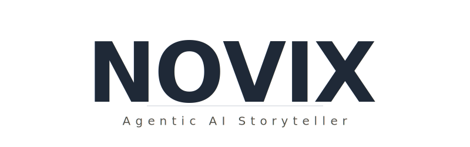

<div align="center">
  
  <br>
  
  <p align="center">
    <strong>深度上下文感知的多智能体小说创作系统</strong>
    <br>
    <em>Context-Aware Multi-Agent Novel Writing System</em>
  </p>
  
  <br>

  <p>
    <a href="https://github.com/unitagain/NOVIX/blob/main/LICENSE"></a>
    <a href="https://github.com/unitagain/NOVIX"></a>
    <a href="#"></a>
    <a href="#"></a>
    <a href="#"></a>
  </p>
  <br>
</div>

---

> ⚖️ **许可协议变更声明 / License Notice**
>
> ⚠️ **Effective Date: January 20, 2026**
>
> 自 **2026年1月20日** 起，NOVIX 项目正式采用 **PolyForm Noncommercial License 1.0.0** 协议。
> The NOVIX project formally adopts the **PolyForm Noncommercial License 1.0.0** starting from **Jan 20, 2026**.
>
> 🛑 **严禁商业使用 (Strictly NO Commercial Use)**
> *   未经作者书面授权，禁止任何形式的商业用途（包括销售、SaaS服务、企业内部盈利性使用等）。
> *   Commercial use of any kind without written permission is strictly prohibited.
>
> *在此日期之前发布的旧版本代码仍受原 MIT 协议约束。*

**NOVIX** 不仅仅是一个写作工具，更是一个精密的**AI 编辑部**。

长篇小说的创作是一项系统工程，核心挑战在于**"遗忘"**与**"失控"**。NOVIX 拒绝将写作简化为线性的"提示生成"，而是通过**结构化工程 (Context Engineering)** 与 **精细分工 (Multi-Agent)**，让 AI 真正理解并掌控庞大的叙事网络。

我们采用了全新的 **"Calm & Focus"** 设计语言——以纸张的质感、优雅的衬线字体和无干扰的极简主义，为您创造一隅静谧的创作空间，让思维随光标流淌。

---

## ✨ 核心特性 (Features)

### 🤖 工业级多智能体协作 (Agentic Workflow)

模拟真实的编辑部工作流，各司其职，紧密协作：

```mermaid
graph LR
    %% 样式定义
    classDef user fill:#2563EB,stroke:#1D4ED8,stroke-width:2px,color:#fff
    classDef creative fill:#F0F9FF,stroke:#0EA5E9,stroke-width:2px,color:#0369A1
    classDef quality fill:#FFF1F2,stroke:#F43F5E,stroke-width:2px,color:#BE123C
    classDef memory fill:#FEFCE8,stroke:#EAB308,stroke-width:2px,color:#854D0E
    classDef artifact fill:#F3F4F6,stroke:#6B7280,stroke-width:1px,stroke-dasharray: 5 5

    User((User)):::user -->|设定目标| Director
    
    subgraph "✨ 创意核心 Creative Core"
        Director[🎬 导演 Director]:::creative -->|编排大纲| Writer[✍️ 撰稿人 Writer]:::creative
    end

    subgraph "🧠 记忆系统 Memory System"
        Archivist[🗃️ 档案员 Archivist]:::memory
        Canon[(动态事实表)]:::memory
    end

    subgraph "💎 质量保证 Quality Assurance"
        Writer -->|初稿| Reviewer[🧐 审阅员 Reviewer]:::quality
        Reviewer -->|修订意见| Editor[📝 编辑 Editor]:::quality
    end

    Editor -->|润色完成| Draft([📄 最终草稿]):::artifact
    
    %% 交互流
    Archivist -.->|设定检索| Writer
    Draft -.->|新设定提取| Archivist
    Archivist -->|更新| Canon
    
    %% 连接样式
    linkStyle default stroke:#64748B,stroke-width:1.5px
```



### 📚 同人创作支持 (Fanfiction Support)

NOVIX 现已支持从 Wiki 导入世界观，为同人创作提供强大助力：

*   **🌐 多源 Wiki 接入**: 支持 **萌娘百科**、**Fandom**、**Wikipedia** 等主流 Wiki 站点。
*   **⚡ 极速批量提取**: 独创的并发爬取与聚合算法，支持一次性提取数十个角色/设定，效率提升 **10 倍**。
*   **🧬 深度结构化**: 自动解析 Infobox 与正文，提取角色**外貌**、**性格**、**人际关系**等关键信息，直接生成可用的设定卡片。

### 🧠 深度上下文工程 (Deep Context)

NOVIX 通过动态维护**世界状态**，解决长篇连载中的一致性问题：

*   **🗃️ 智能档案员**: 自动检测剧情中产生的新角色、地点或设定，并提议将其归档。
*   **📜 动态事实表**: 随着剧情推进，自动累积关键事实（如"主角受伤"、"获得宝物"），并在后续生成中自动召回。
*   **🎯 精准召回**: 每次生成只提取当前场景最相关的 5% 信息，大幅减少 Token 消耗并消除幻觉。

### 🎨 沉浸式创作体验 (Calm UI)

*   **设定提案**: AI 在生成过程中会自动发现新设定的诞生，您可以一键采纳或拒绝，保持设定集的时效性。
*   **专注模式**: 全屏无干扰的写作界面，混排 `Noto Serif SC` 与 `Inter`，还原经典书写体验。
*   **Git-Native**: 所有数据以 YAML/Markdown 存储，天然支持版本控制与回滚。

---

## 🚀 快速上手 (Quick Start)

### 📦 方式一：下载 Release 版本（推荐普通用户）

**零配置，开箱即用！** 无需安装 Python 或 Node.js。

1. 📥 前往 **[Releases 页面](https://github.com/unitagain/NOVIX/releases)** 下载最新版本
   - Windows 用户：下载 `NOVIXv0.x.x.zip`
   
2. 📂 解压到任意目录

3. ▶️ 双击运行 **`NOVIX.exe`**
   - 系统会自动启动后台服务
   - 默认浏览器会自动打开操作界面 (http://localhost:8000)
   
4. ⚙️ 初次使用需配置 API Key
   - 点击右上角 **"设置 → 智能体配置"**
   - 填入您的 **OpenAI** / **Anthropic** / **DeepSeek** API Key
   - 或选择 **Mock 模式**进行功能体验（无需真实 Key）

5. ✨ 开始创作！
   - 创建新项目 → 配置角色/世界观卡片 → 开启写作会话

---

### 💻 方式二：从源码运行（开发者 / 贡献者）

适用于希望修改代码、调试功能或为项目贡献的开发者。

#### 📋 环境要求
- **Python**: 3.10 或更高版本
- **Node.js**: 18 或更高版本
- **Git**: 用于克隆仓库和版本管理

#### 🔧 安装步骤

```bash
# 1. 克隆仓库
git clone https://github.com/unitagain/NOVIX.git
cd NOVIX-main

# 2. 一键启动（自动安装依赖）
# Windows 用户
start.bat

# macOS/Linux 用户
./start.sh
```

启动脚本会自动完成：
- ✅ 安装 Python 依赖 (`pip install -r backend/requirements.txt`)
- ✅ 安装 Node.js 依赖 (`npm install` in frontend/)
- ✅ 启动后端服务 (FastAPI on http://localhost:8000)
- ✅ 启动前端服务 (Vite Dev Server on http://localhost:3000)

#### 🌐 访问应用
- **前端界面**: http://localhost:3000 （支持热重载 HMR）
- **后端 API**: http://localhost:8000
- **API 文档**: http://localhost:8000/docs （FastAPI Swagger UI）

#### ⚙️ 配置说明
1. 复制后端配置模板：
   ```bash
   cp backend/.env.example backend/.env
   ```
2. 编辑 `backend/.env`，填入您的 API Keys：
   ```env
   OPENAI_API_KEY=sk-your-key-here
   DEEPSEEK_API_KEY=your-deepseek-key
   ANTHROPIC_API_KEY=your-anthropic-key
   ```
3. （可选）编辑 `backend/config.yaml` 自定义智能体行为参数

---

### 🤝 贡献代码 (Contributing)

我们非常欢迎社区贡献！如果您希望提交 Pull Request：

#### 📝 贡献流程
1. **Fork** 本仓库到您的 GitHub 账号
2. **Clone** 您 Fork 的仓库到本地：
   ```bash
   git clone https://github.com/YOUR_USERNAME/NOVIX.git
   cd NOVIX
   ```
3. **创建功能分支**（基于 `main`）：
   ```bash
   git checkout -b feature/your-feature-name
   ```
4. **进行开发与测试**
   - 遵循现有代码风格
   - 确保功能完整且可运行
   - 添加必要的注释和文档
5. **提交变更**：
   ```bash
   git add .
   git commit -m "feat: add your feature description"
   ```
6. **推送到您的 Fork**：
   ```bash
   git push origin feature/your-feature-name
   ```
7. **提交 Pull Request**：
   - 前往原仓库的 [Pull Requests](https://github.com/unitagain/NOVIX/pulls) 页面
   - 点击 "New Pull Request"
   - 选择您的分支并填写清晰的 PR 描述
   - 等待维护者 Review

#### ✅ PR 规范
- **标题格式**：`feat/fix/docs/refactor: 简要描述`
- **描述内容**：
  - 🎯 解决的问题或实现的功能
  - 🛠️ 技术方案简述
  - 📸 （如涉及 UI）附上截图或演示
- **代码质量**：
  - 确保后端代码通过基本的语法检查
  - 确保前端代码能正常构建 (`npm run build`)

#### 💡 贡献方向建议
- 🐛 修复 Bug
- ✨ 新增功能（如新的智能体、UI 组件）
- 📚 完善文档和示例
- 🌍 国际化支持（英文翻译等）
- 🎨 UI/UX 优化

---

## 🛠️ 技术栈 (Tech Stack)

| 领域 | 技术方案 |
| :--- | :--- |
| **Frontend** | React, Vite, TailwindCSS (v3), Lucide React |
| **Backend** | FastAPI, Pydantic, Python-dotenv |
| **Storage** | File-based (YAML/Markdown/JSONL) |
| **AI Core** | OpenAI API Standard (Supports DeepSeek/Claude/GPT-4o) |

---

## ⚖️ 许可协议 (License)

本项目采用 **PolyForm Noncommercial License 1.0.0**。

> **"源代码可用" (Source Available) ≠ "开源" (Open Source)**

### ✅ 允许 (Permitted)
*   **个人非商业使用**：您可以自由下载、运行、修改代码用于个人学习、研究或娱乐。
*   **非营利组织使用**：慈善机构、学校等因教育目的使用。

### 🚫 绝对禁止 (Strictly Prohibited)
*   **禁止任何商业行为**：哪怕只赚 1 分钱也是违法的。
*   **禁止公司内部使用**：如果您的公司是营利性实体，即使只是内部工具通过此软件提效，也被视为商业用途。
*   **禁止“洗稿”**：禁止修改代码后换皮发布商业产品。

📄 完整法律文本请查看 [LICENSE](./LICENSE) 文件。任何违反本协议的行为都将面临法律追责。

---

### 💼 商业授权 (Commercial Licensing)

如果您希望将 NOVIX 用于任何商业目的（包括但不限于 SaaS、企业部署、二次开发销售），您**必须**获得作者的书面授权。

请联系：
*   **Email**: `1467673018@qq.com`
*   **GitHub**: [unitagain](https://github.com/unitagain)

---

<div align="center">
  <br>
  <p>Made with ❤️ by the NOVIX Team</p>
  <p><em>Let the story unfold.</em></p>
</div>
