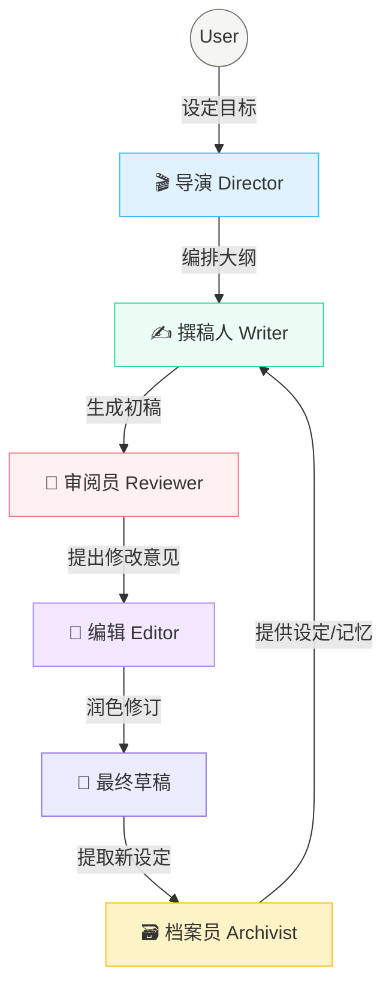

<div align="center">
  
  <br>
  
  <p align="center">
    <strong>深度上下文感知的多智能体小说创作系统</strong>
    <br>
    <em>Context-Aware Multi-Agent Novel Writing System</em>
  </p>
  
  <br>

  <p>
    <a href="https://github.com/unitagain/NOVIX/blob/main/LICENSE"></a>
    <a href="https://github.com/unitagain/NOVIX"></a>
    <a href="#"></a>
    <a href="#"></a>
    <a href="#"></a>
  </p>
  <br>
</div>

---

## 📖 简介 (Introduction)

**NOVIX** 不仅仅是一个写作工具，更是一个精密的**AI 编辑部**。

长篇小说的创作是一项系统工程，核心挑战在于**"遗忘"**与**"失控"**。NOVIX 拒绝将写作简化为线性的"提示生成"，而是通过**结构化工程 (Context Engineering)** 与 **精细分工 (Multi-Agent)**，让 AI 真正理解并掌控庞大的叙事网络。

我们采用了全新的 **"Calm & Focus"** 设计语言——以纸张的质感、优雅的衬线字体和无干扰的极简主义，为您创造一隅静谧的创作空间，让思维随光标流淌。

---

## ✨ 核心特性 (Features)

### 🤖 工业级多智能体协作 (Agentic Workflow)

模拟真实的编辑部工作流，各司其职，紧密协作：



### 🧠 深度上下文工程 (Deep Context)

NOVIX 通过动态维护**世界状态**，解决长篇连载中的一致性问题：

*   **🗃️ 智能档案员**: 自动检测剧情中产生的新角色、地点或设定，并提议将其归档。
*   **📜 动态事实表**: 随着剧情推进，自动累积关键事实（如"主角受伤"、"获得宝物"），并在后续生成中自动召回。
*   **🎯 精准召回**: 每次生成只提取当前场景最相关的 5% 信息，大幅减少 Token 消耗并消除幻觉。

### 🎨 沉浸式创作体验 (Calm UI)

*   **设定提案**: AI 在生成过程中会自动发现新设定的诞生，您可以一键采纳或拒绝，保持设定集的时效性。
*   **专注模式**: 全屏无干扰的写作界面，混排 `Noto Serif SC` 与 `Inter`，还原经典书写体验。
*   **Git-Native**: 所有数据以 YAML/Markdown 存储，天然支持版本控制与回滚。

---

## 🚀 快速开始 (Quick Start)

### 1. 环境准备
确保已安装 **Python 3.10+** 和 **Node.js 18+**。

### 2. 一键启动
```bash
git clone https://github.com/unitagain/NOVIX.git
cd NOVIX

# Windows
start.bat

# macOS/Linux
./start.sh
```
脚本将自动初始化环境并启动服务：
- 🌐 **前端**: http://localhost:3000
- 📡 **后端**: http://localhost:8000

### 3. 配置 LLM
在 **"设置 -> 智能体配置"** 中填入您的 API Key (OpenAI / Anthropic / DeepSeek)。
> *系统支持 Mock 模式，无需 Key 即可体验流程。*

---

## 🛠️ 技术栈 (Tech Stack)

| 领域 | 技术方案 |
| :--- | :--- |
| **Frontend** | React, Vite, TailwindCSS (v3), Lucide React |
| **Backend** | FastAPI, Pydantic, Python-dotenv |
| **Storage** | File-based (YAML/Markdown/JSONL) |
| **AI Core** | OpenAI API Standard (Supports DeepSeek/Claude/GPT-4o) |

---

<div align="center">
  <br>
  <p>Made with ❤️ by the NOVIX Team</p>
  <p><em>Let the story unfold.</em></p>
</div>
